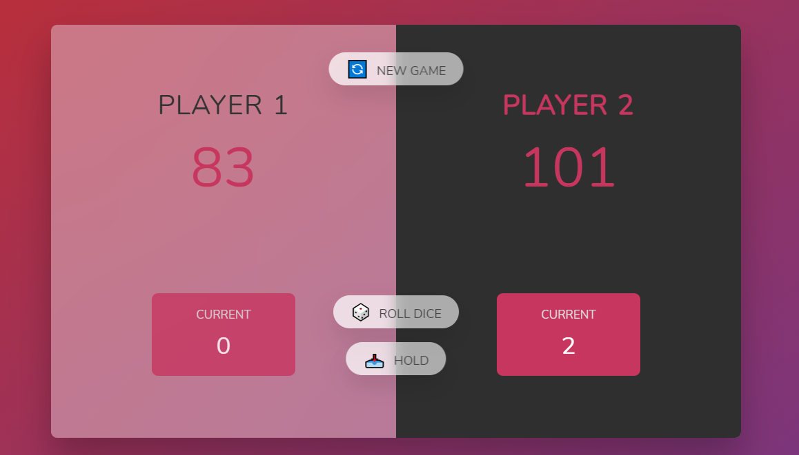

<h2>PIG GAME!!! 🎲</h2>

  That's a cool dice rolling game. You can play with a friend or even alone
  (against yourself 😅). The dice rolls randomly and gives a number, as usual,
  between 1 and 6, but, if the player gets 1 he loses all of the points of the
  round and the game switches to the other player. The player who first achieves
  the 100 points wins!

  I had a great time building (along with the teacher, of course) this project.
  It was a hard one, but I pushed my abilities and at the end it worthed it.

  With the pig game I've practiced some more of class and DOM manipulation and
  events.

<h2>Final Result:</h2>

Initial page:

During the game

When someone wins 🎉

Made with 💖 by Marília Pacífico.

